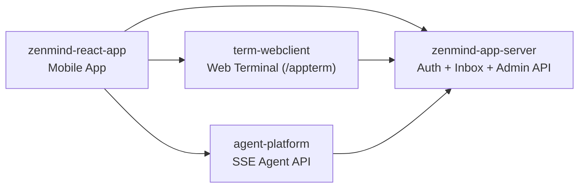

# ZenMind

[](LICENSE)
[](https://github.com/linlay/zenmind)
[](https://github.com/linlay/zenmind/releases)

[Default (Chinese)](README.md) | [Chinese Standalone](README.zh-CN.md) | [English](README.en.md)

ZenMind is an open-source project collection focused on AI Agent workflows.

## Overview

The `zenmind` repository is the hub portal for system overview and sub-repository navigation.

This repository does not contain business code and mainly manages documentation and links.

## Key Features

- Unified multi-repo entry point for mobile, backend, and terminal components.
- Clear component boundaries with an architecture relationship diagram.
- Centralized release access links for all sub-projects.

## Components

| Component | Repository | Description | Tech Stack | Typical Release Artifacts |
|---|---|---|---|---|
| Mobile App | [zenmind-react-app](https://github.com/linlay/zenmind-react-app) | Mobile chat, terminal, agent, and user settings. | Expo + React Native + TypeScript | Android APK / Expo build artifacts |
| Auth and Admin | [zenmind-app-server](https://github.com/linlay/zenmind-app-server) | Auth center, device auth, inbox, and admin APIs. | Spring Boot + Vite + Docker Compose | `release/` package (backend JAR + frontend dist + compose files) |
| Terminal Web Client (`term-webclient`) | [term-webclient](https://github.com/linlay/term-webclient) | Multi-tab terminal (local PTY + SSH) with session recovery. | Spring Boot + React + xterm.js | `release/` package (`app.jar`, `dist`, `start/stop` scripts) |
| Agent Service (`agent-platform`) | [agent-platform](https://github.com/linlay/agent-platform) | Agent orchestration and SSE event streaming APIs. | Spring Boot + Spring AI | Fat JAR / Docker image |

## System Relationship (Simplified)



## Quick Start (Cross-Repo Experience)

1. Start [zenmind-app-server](https://github.com/linlay/zenmind-app-server) as the shared auth and inbox backend.
2. Start [term-webclient](https://github.com/linlay/term-webclient) for terminal capabilities.
3. Start [agent-platform](https://github.com/linlay/agent-platform) for agent APIs.
4. Install and configure [zenmind-react-app](https://github.com/linlay/zenmind-react-app), then point endpoints to your deployment.

## Interactive Setup (macOS)

This repository provides unified setup scripts organized by platform under `scripts/mac` and `scripts/windows`.

Compatibility entrypoints are still available: `setup-mac.sh` and `setup-windows.bat` (which delegates to `scripts/windows/setup.ps1`).

Script directory convention: `scripts/mac` stores `.sh`, and `scripts/windows` stores `.ps1` / `.bat`.

```bash
./scripts/mac/setup.sh
```

```bat
.\scripts\windows\setup.bat
```

Menu options:

- `1` Environment precheck (install/version/runtime + fix commands)
- `2` First install
- `3` Update (re-clone + package + move, no auto restart)
- `4` Start (runtime precheck is mandatory before start)
- `5` Stop
- `0` Exit

You can also run non-interactive actions:

```bash
./scripts/mac/setup.sh --action precheck --base-dir /your/workspace
./scripts/mac/setup.sh --action first-install --base-dir /your/workspace
./scripts/mac/setup.sh --action update --base-dir /your/workspace
./scripts/mac/setup.sh --action start --base-dir /your/workspace
./scripts/mac/setup.sh --action stop --base-dir /your/workspace
./scripts/mac/setup.sh --action first-install --yes
```

`first-install` includes:

- Create workspace directories: `source/` and `release/`
- Clone all 3 sub-repositories into `source/<repo>`
- Package first:
- `term-webclient`: `./release-scripts/mac/package.sh`
- `zenmind-app-server`: `./release-scripts/mac/package.sh`
- `agent-platform-runner`: `./release-scripts/mac/package-local.sh`
- Move packaged artifacts from each repo into `release/<repo>`
- Then copy config into unified release directories using `cp`:
- `source/term-webclient/.env.example` (or `source/term-webclient/env.example`) `-> release/term-webclient/.env`
- `source/term-webclient/application.example.yml -> release/term-webclient/application.yml`
- `source/zenmind-app-server/.env.example -> release/zenmind-app-server/.env`
- `source/agent-platform-runner/application.example.yml -> release/agent-platform-runner/application.yml`
- Write bcrypt password hashes into release env files:
- `release/term-webclient/.env`
- `release/zenmind-app-server/.env`
- No environment checks are executed in `first-install` anymore (run `precheck` first)

`update` now includes:

- Backup existing runtime config files under `release/*`
- Delete old `source/<repo>` and re-clone
- Re-package and move artifacts into `release/<repo>`
- Restore previous configs and fill missing ones from examples

`start` includes:

- Mandatory runtime check via `./scripts/mac/check-environment.sh --mode runtime`
- If runtime requirements fail, start exits immediately

## FAQ and Troubleshooting

- Q: Why does first-install no longer show environment errors?
- A: Environment checks were split out. Run `./setup-mac.sh --action precheck` for a clean report and install commands.

- Q: Why does update not use `git pull` anymore?
- A: The default strategy is now `clone + package + move` to keep `source/` and `release/` consistently rebuilt.

- Q: Why was my config file overwritten?
- A: `first-install` overwrites runtime config by default, but creates a timestamp backup first.

- Q: Service is still unavailable after `start`.
- A: Check the health-check output first, then verify:
- release artifacts exist (if missing, run `release-scripts/mac/package.sh` / `release-scripts/mac/package-local.sh`)
- Docker Desktop is running
- startup logs and PID files under each sub-repo
- local port conflicts

- Q: Why can install checks pass while `start` still fails?
- A: `start` depends on runtime readiness (especially Docker daemon). Run `./scripts/mac/check-environment.sh --mode runtime` or the precheck menu item first.

## Release Status

Release links are reserved and currently in planned status, not generally available yet.

- ZenMind App: [zenmind-react-app/releases/latest](https://github.com/linlay/zenmind-react-app/releases/latest)
- App Server: [zenmind-app-server/releases/latest](https://github.com/linlay/zenmind-app-server/releases/latest)
- Terminal Web Client: [term-webclient/releases/latest](https://github.com/linlay/term-webclient/releases/latest)
- Agent Platform: [agent-platform/releases/latest](https://github.com/linlay/agent-platform/releases/latest)

## Repository Links

- Hub repository: [linlay/zenmind](https://github.com/linlay/zenmind)
- Mobile App: [linlay/zenmind-react-app](https://github.com/linlay/zenmind-react-app)
- Auth and Admin: [linlay/zenmind-app-server](https://github.com/linlay/zenmind-app-server)
- Terminal Web Client: [linlay/term-webclient](https://github.com/linlay/term-webclient)
- Agent Service: [linlay/agent-platform](https://github.com/linlay/agent-platform)

## Contributing

Issues and Pull Requests are welcome.

- For feature changes, submit to the relevant sub-repository.
- For overview docs or navigation links, submit to this repository.

## License

This project is licensed under the MIT License. See [LICENSE](LICENSE).
