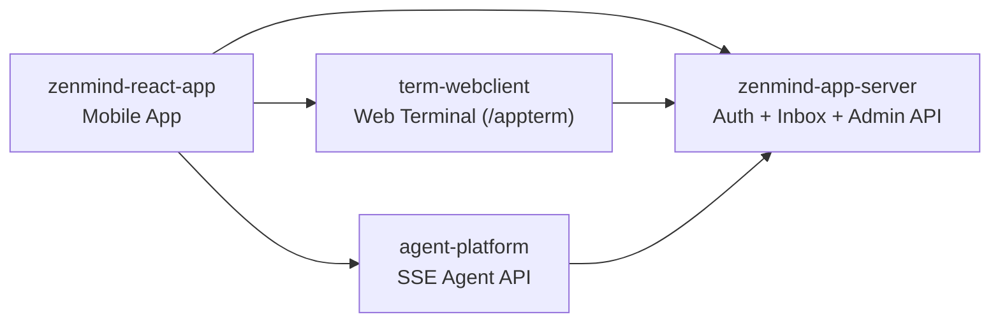

# ZenMind

[Default (Chinese)](README.md) | [Chinese Standalone](README.zh-CN.md) | [English](README.en.md)

ZenMind is an open-source project collection focused on AI Agent workflows.

## Overview

The `zenmind` repository is the hub portal for system overview and sub-repository navigation.

This repository does not contain business code and mainly manages documentation and links.

## Key Features

- Unified multi-repo entry point for mobile, backend, and terminal components.
- Clear component boundaries with an architecture relationship diagram.
- Centralized release access links for all sub-projects.

## Components

| Component | Repository | Description | Tech Stack | Typical Release Artifacts |
|---|---|---|---|---|
| Mobile App | [zenmind-react-app](https://github.com/linlay/zenmind-react-app) | Mobile chat, terminal, agent, and user settings. | Expo + React Native + TypeScript | Android APK / Expo build artifacts |
| Auth and Admin | [zenmind-app-server](https://github.com/linlay/zenmind-app-server) | Auth center, device auth, inbox, and admin APIs. | Spring Boot + Vite + Docker Compose | `release/` package (backend JAR + frontend dist + compose files) |
| Terminal Web Client (`pty-webclient`) | [term-webclient](https://github.com/linlay/term-webclient) | Multi-tab terminal (local PTY + SSH) with session recovery. | Spring Boot + React + xterm.js | `release/` package (`app.jar`, `dist`, `start/stop` scripts) |
| Agent Service (`agw-springai-agent`) | [agent-platform](https://github.com/linlay/agent-platform) | Agent orchestration and SSE event streaming APIs. | Spring Boot + Spring AI | Fat JAR / Docker image |

## System Relationship (Simplified)

## Quick Start (Cross-Repo Experience)

1. Start [zenmind-app-server](https://github.com/linlay/zenmind-app-server) as the shared auth and inbox backend.
2. Start [term-webclient](https://github.com/linlay/term-webclient) for terminal capabilities.
3. Start [agent-platform](https://github.com/linlay/agent-platform) for agent APIs.
4. Install and configure [zenmind-react-app](https://github.com/linlay/zenmind-react-app), then point endpoints to your deployment.

## Release Status

Release links are reserved and currently in planned status, not generally available yet.

- ZenMind App: [zenmind-react-app/releases/latest](https://github.com/linlay/zenmind-react-app/releases/latest)
- App Server: [zenmind-app-server/releases/latest](https://github.com/linlay/zenmind-app-server/releases/latest)
- Terminal Web Client: [term-webclient/releases/latest](https://github.com/linlay/term-webclient/releases/latest)
- Agent Platform: [agent-platform/releases/latest](https://github.com/linlay/agent-platform/releases/latest)

## Repository Links

- Hub repository: [linlay/zenmind](https://github.com/linlay/zenmind)
- Mobile App: [linlay/zenmind-react-app](https://github.com/linlay/zenmind-react-app)
- Auth and Admin: [linlay/zenmind-app-server](https://github.com/linlay/zenmind-app-server)
- Terminal Web Client: [linlay/term-webclient](https://github.com/linlay/term-webclient)
- Agent Service: [linlay/agent-platform](https://github.com/linlay/agent-platform)

## Contributing

Issues and Pull Requests are welcome.

- For feature changes, submit to the relevant sub-repository.
- For overview docs or navigation links, submit to this repository.

## License

This project is licensed under the MIT License. See [LICENSE](LICENSE).
