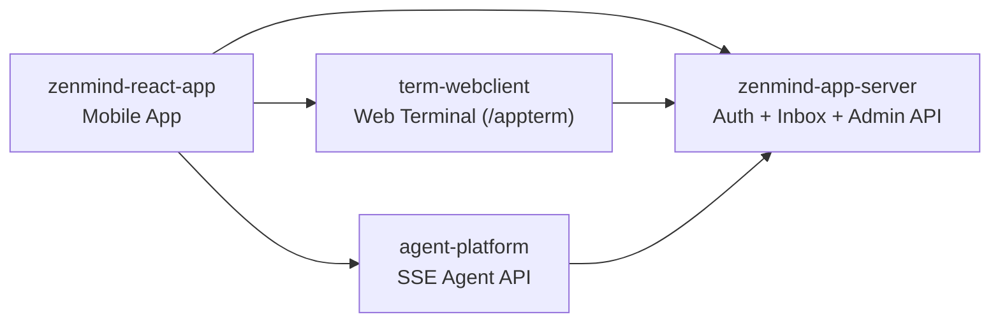

# ZenMind

[默认 (中文)](README.md) | [简体中文独立页](README.zh-CN.md) | [English](README.en.md)

ZenMind 是一个面向 AI Agent 工作流的开源项目集合。

## 项目简介

`zenmind` 仓库是项目总入口，用于统一展示系统全貌和子仓库导航。

本仓库不承载业务代码，主要负责文档与链接管理。

## 核心特性

- 多仓库统一入口：集中访问移动端、服务端和终端组件。
- 跨组件关系清晰：提供系统关系图和职责边界。
- 发布入口统一：集中维护各子项目 Release 访问链接。

## 项目组成

| 组件 | 仓库 | 说明 | 主要技术栈 | 典型 Release 产物 |
|---|---|---|---|---|
| 移动端 App | [zenmind-react-app](https://github.com/linlay/zenmind-react-app) | 移动端聊天、终端、智能体与用户设置。 | Expo + React Native + TypeScript | Android APK / Expo 构建产物 |
| 统一认证与管理端 | [zenmind-app-server](https://github.com/linlay/zenmind-app-server) | 认证中心、设备认证、消息盒子与管理端 API。 | Spring Boot + Vite + Docker Compose | `release/` 包（backend JAR + frontend dist + compose） |
| 终端 Web 客户端 (`pty-webclient`) | [term-webclient](https://github.com/linlay/term-webclient) | 多标签终端（本地 PTY + SSH），支持断线恢复。 | Spring Boot + React + xterm.js | `release/` 包（`app.jar`、`dist`、`start/stop` 脚本） |
| Agent 服务端 (`agw-springai-agent`) | [agent-platform](https://github.com/linlay/agent-platform) | Agent 编排与 SSE 事件流接口。 | Spring Boot + Spring AI | Fat JAR / Docker 镜像 |

## 系统关系（简化）

## 快速开始（跨仓库体验）

1. 启动 [zenmind-app-server](https://github.com/linlay/zenmind-app-server) 作为统一认证与消息服务。
2. 启动 [term-webclient](https://github.com/linlay/term-webclient) 提供终端能力。
3. 启动 [agent-platform](https://github.com/linlay/agent-platform) 提供 Agent 接口。
4. 安装并配置 [zenmind-react-app](https://github.com/linlay/zenmind-react-app)，将后端地址指向你的部署环境。

## Release 状态

当前各组件 Release 入口已预留，状态为计划中（Planned），暂未全面开放（Not generally available yet）。

- ZenMind App: [zenmind-react-app/releases/latest](https://github.com/linlay/zenmind-react-app/releases/latest)
- App Server: [zenmind-app-server/releases/latest](https://github.com/linlay/zenmind-app-server/releases/latest)
- Terminal Web Client: [term-webclient/releases/latest](https://github.com/linlay/term-webclient/releases/latest)
- Agent Platform: [agent-platform/releases/latest](https://github.com/linlay/agent-platform/releases/latest)

## 仓库链接

- Hub repository: [linlay/zenmind](https://github.com/linlay/zenmind)
- Mobile App: [linlay/zenmind-react-app](https://github.com/linlay/zenmind-react-app)
- Auth and Admin: [linlay/zenmind-app-server](https://github.com/linlay/zenmind-app-server)
- Terminal Web Client: [linlay/term-webclient](https://github.com/linlay/term-webclient)
- Agent Service: [linlay/agent-platform](https://github.com/linlay/agent-platform)

## 贡献方式

欢迎提交 Issue 或 Pull Request。

- 业务功能改进：请提交到对应子仓库。
- 总览文档或导航链接改进：请提交到当前仓库。

## 许可证

本项目基于 MIT 协议开源，详见 [LICENSE](LICENSE)。
