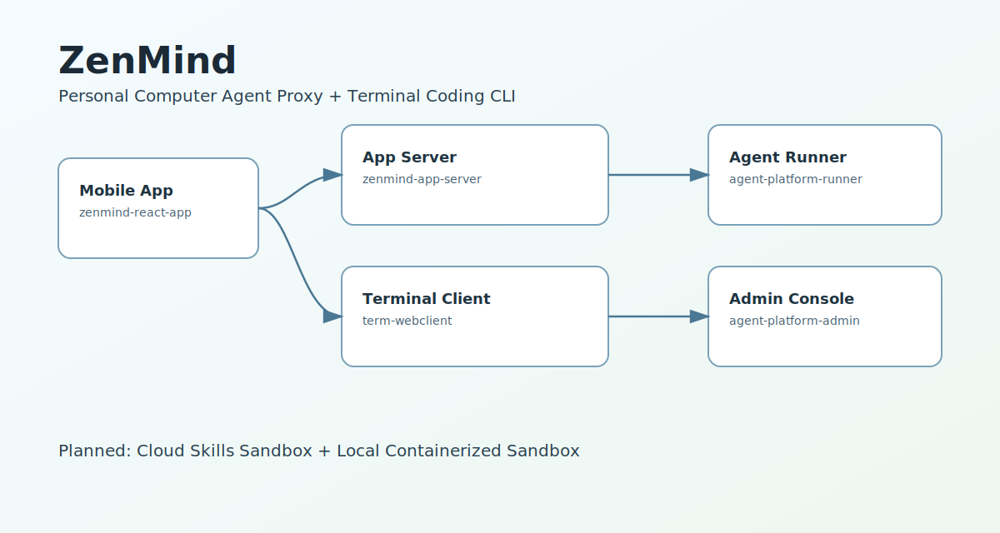
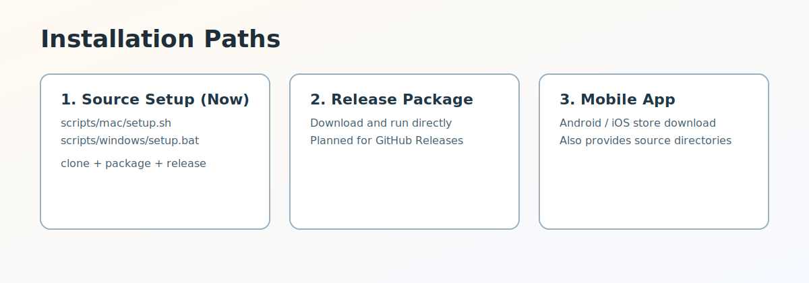

# ZenMind

[](LICENSE)
[](https://github.com/linlay/zenmind)
[](https://github.com/linlay/zenmind/releases)

[默认 (中文)](README.md) | [简体中文独立页](README.zh-CN.md) | [English](README.en.md)

ZenMind 是一个个人电脑智能体代理（PC Agent Proxy），支持连接终端控制台并使用编码 CLI。

## 快速了解

[](https://github.com/linlay/zenmind/releases)




## 安装方式

1. 源码安装（当前可用）：使用本仓库 `setup` 流程拉取、打包并启动。
2. Release 包安装（规划中）：后续提供可直接下载运行的发布包。
3. 手机应用安装：将提供应用市场下载；Android / iOS 也会提供源码目录。

源码安装入口：

```bash
# macOS
./scripts/mac/setup.sh

# Windows
.\scripts\windows\setup.bat
```

常用非交互命令：

```bash
./scripts/mac/setup.sh --action precheck
./scripts/mac/setup.sh --action first-install
./scripts/mac/setup.sh --action start
```

## 项目地图

| 项目 | 角色定位 |
|---|---|
| [zenmind-app-server](https://github.com/linlay/zenmind-app-server) | App 管理服务（认证、设备认证、消息盒子、管理 API） |
| [agent-platform-runner](https://github.com/linlay/agent-platform-runner) | 智能体运行器（Agent 编排与运行） |
| [term-webclient](https://github.com/linlay/term-webclient) | 控制台客户端（Web Terminal，支持编码 CLI） |
| [agent-platform-admin](https://github.com/linlay/agent-platform-admin) | 智能体管理端 |
| [zenmind-react-app](https://github.com/linlay/zenmind-react-app) | 移动端 App（终端、智能体、账号配置） |

规划能力：

- 云端 Skills 沙箱（Planned）
- 本地容器化沙箱（Planned）

## 这个仓库做什么

`zenmind` 是总入口仓库，负责：

- 统一导航各子项目
- 提供跨仓库 setup 入口
- 维护 release 链接与总览文档

## License

MIT. See [LICENSE](LICENSE).
