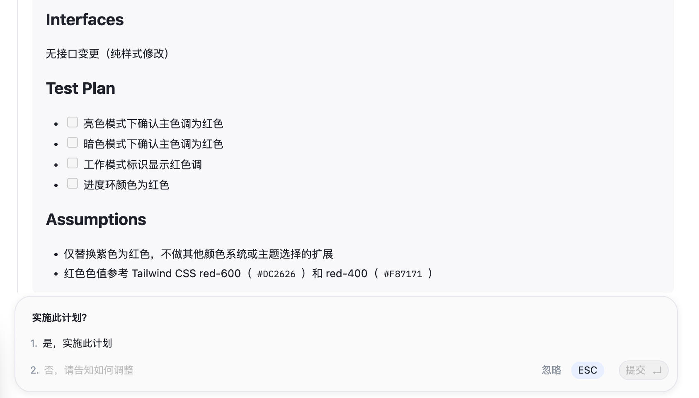
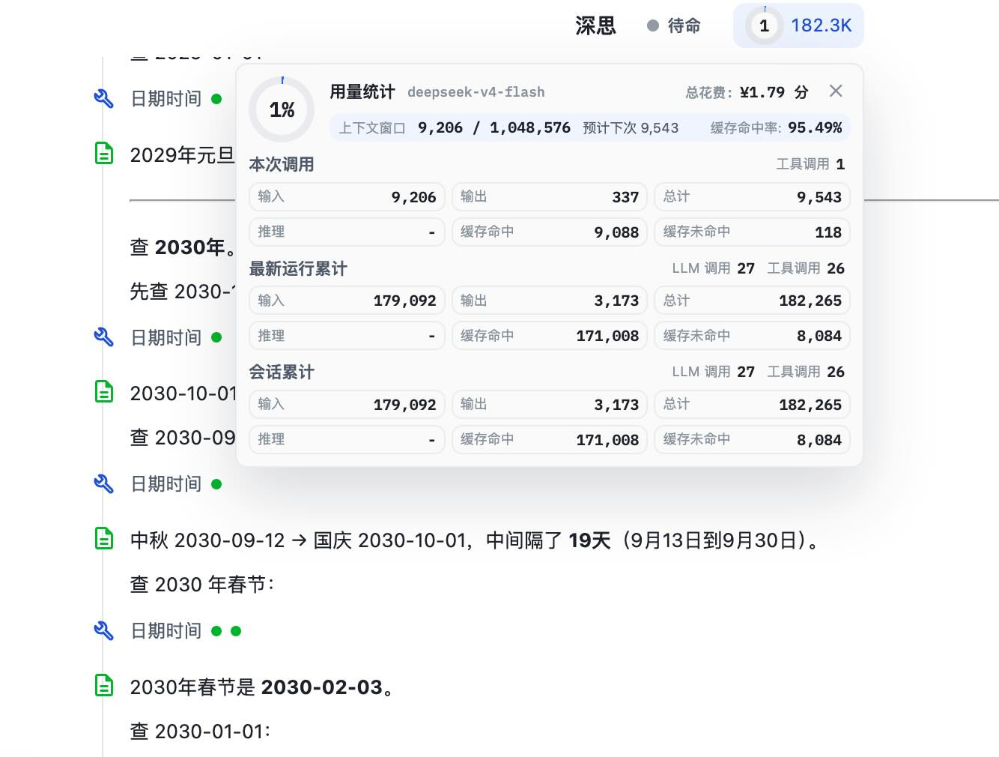
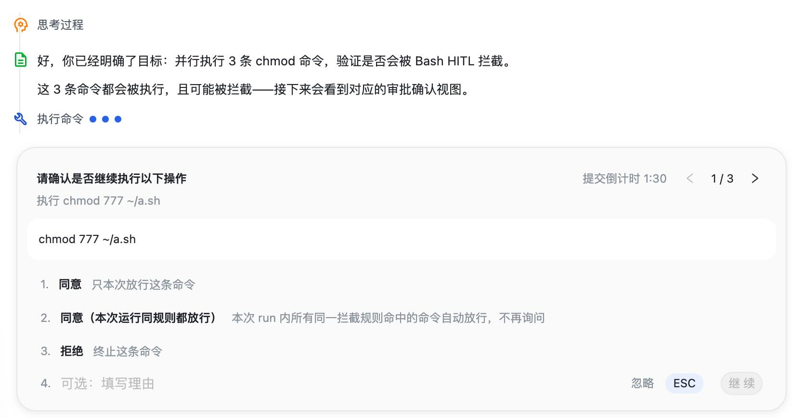

# ZenMind

[English](./README.md) | [简体中文](./docs/README.zh-CN.md)

ZenMind is a desktop-first AI agent platform for local, web, and mobile workflows.

It packages the core agent runtime into one Desktop experience, connects to modern Chinese model ecosystems such as DeepSeek V4 (`deepseek-v4-pro` and `deepseek-v4-flash`), MiMo, MiniMax M3, and Qwen/Bailian, and exposes a custom AGW UI protocol for rich agent interaction.

## Website

[www.zenmind.cc](https://www.zenmind.cc) provides official Desktop installers. You can also build ZenMind Desktop directly from this open-source project.

## About

ZenMind starts from a simple idea: the computer staying at home should become a capable AI agent workspace, not just an idle machine. It is building toward an OpenClaw-inspired, desktop-first platform where local services, web clients, mobile clients, and Chinese model ecosystems work together through one protocol.

## Highlights

- One Desktop app to install, initialize, start, stop, and monitor the ZenMind services.
- Native support direction for DeepSeek V4 (`deepseek-v4-pro` and `deepseek-v4-flash`), MiMo, MiniMax M3, Qwen/Bailian, and MiniMax office workflows.
- A custom AGW UI protocol for streaming output, HITL approval, viewport rendering, usage telemetry, and sub-agent invocation.
- A local sandbox layer for long-lived agent sessions, tool environments, and office/document automation.
- Designed for the same agent experience across Desktop, web clients, and upcoming mobile clients.

## Agent Configuration

| Model | Context | Max thinking effort | Official DeepSeek API Docs pricing |
| --- | --- | --- | --- |
| `deepseek-v4-flash` | `maxInputTokens: 1048576` (1M context) | `reasoning_effort=max` | cache hit `$0.0028`, cache miss `$0.14`, output `$0.28` per 1M tokens |
| `deepseek-v4-pro` | `maxInputTokens: 1048576` (1M context) | `reasoning_effort=max` | cache hit `$0.003625`, cache miss `$0.435`, output `$0.87` per 1M tokens |

The runtime registry uses the current V4 model IDs, `maxOutputTokens: 393216`, and pricing fields for cache-hit input, cache-miss input, and output tokens. See [Model Support](./docs/models.md) for the verified field mapping.

## Demo Video

> Placeholder: add the ZenMind walkthrough video here.

## Screenshots

  
   
   
  
   
   
  

## One-Click Desktop

ZenMind is distributed through ZenMind Desktop. The Desktop app wraps the core services, prepares local configuration, starts the runtime in the right order, and gives users a single control center for the whole system.

Download the official installer from [www.zenmind.cc](https://www.zenmind.cc), or package it yourself from this open-source repository.

## Core Architecture

  

ZenMind Desktop brings together four core services:

- `zenmind-app-server`: authentication, OIDC, admin console, and app access tokens.
- `agent-platform`: agent runtime, model registry, tools, memory, HITL, usage, and sub-agent orchestration.
- `agent-webclient`: chat UI, timeline, model switching, viewport rendering, and usage display.
- `agent-container-hub`: local sandbox sessions, environment templates, and container-backed tool runtimes.

## AGW UI Protocol

AGW UI is ZenMind's custom protocol between clients and the Agent Platform. It combines HTTP, SSE, and optional WebSocket transport with a rich event model for agent work:

- H2A streaming and attach recovery.
- HITL modes for question, approval, form, and plan confirmation.
- Builtin and HTML viewports for interactive agent UI.
- Usage snapshots for tokens, cache, reasoning, tool calls, and estimated cost.
- `agent_invoke` for sub-agent tasks that stream back into the main timeline.

Read more in [AGW UI Protocol](./docs/agwui.md).

## Documentation

- [AGW UI Protocol](./docs/agwui.md)
- [Architecture](./docs/architecture.md)
- [Docs Index](./docs/README.md)
- [Mobile Direction](./docs/mobile.md)
- [Model Support](./docs/models.md)

## License

See [LICENSE](./LICENSE).
