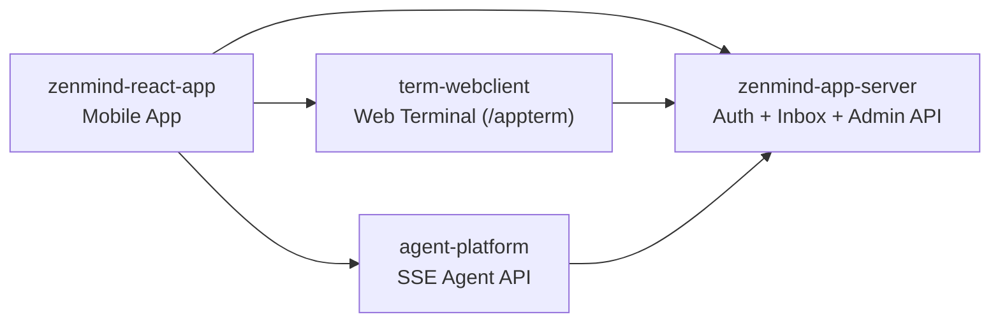

# ZenMind

[](LICENSE)
[](https://github.com/linlay/zenmind)
[](https://github.com/linlay/zenmind/releases)

[默认 (中文)](README.md) | [简体中文独立页](README.zh-CN.md) | [English](README.en.md)

ZenMind 是一个面向 AI Agent 工作流的开源项目集合。

## 项目简介

`zenmind` 仓库是项目总入口，用于统一展示系统全貌和子仓库导航。

本仓库不承载业务代码，主要负责文档与链接管理。

## 核心特性

- 多仓库统一入口：集中访问移动端、服务端和终端组件。
- 跨组件关系清晰：提供系统关系图和职责边界。
- 发布入口统一：集中维护各子项目 Release 访问链接。

## 项目组成

| 组件 | 仓库 | 说明 | 主要技术栈 | 典型 Release 产物 |
|---|---|---|---|---|
| 移动端 App | [zenmind-react-app](https://github.com/linlay/zenmind-react-app) | 移动端聊天、终端、智能体与用户设置。 | Expo + React Native + TypeScript | Android APK / Expo 构建产物 |
| 统一认证与管理端 | [zenmind-app-server](https://github.com/linlay/zenmind-app-server) | 认证中心、设备认证、消息盒子与管理端 API。 | Spring Boot + Vite + Docker Compose | `release/` 包（backend JAR + frontend dist + compose） |
| 终端 Web 客户端 (`term-webclient`) | [term-webclient](https://github.com/linlay/term-webclient) | 多标签终端（本地 PTY + SSH），支持断线恢复。 | Spring Boot + React + xterm.js | `release/` 包（`app.jar`、`dist`、`start/stop` 脚本） |
| Agent 服务端 (`agent-platform`) | [agent-platform](https://github.com/linlay/agent-platform) | Agent 编排与 SSE 事件流接口。 | Spring Boot + Spring AI | Fat JAR / Docker 镜像 |

## 系统关系（简化）



## 快速开始（跨仓库体验）

1. 启动 [zenmind-app-server](https://github.com/linlay/zenmind-app-server) 作为统一认证与消息服务。
2. 启动 [term-webclient](https://github.com/linlay/term-webclient) 提供终端能力。
3. 启动 [agent-platform](https://github.com/linlay/agent-platform) 提供 Agent 接口。
4. 安装并配置 [zenmind-react-app](https://github.com/linlay/zenmind-react-app)，将后端地址指向你的部署环境。

## 交互式 Setup（macOS）

本仓库提供统一安装脚本，按平台放在 `scripts/mac` 与 `scripts/windows`。

兼容入口仍保留：`setup-mac.sh`、`setup-windows.bat`（内部转发到 `scripts/windows/setup.ps1`）。

脚本目录约定：`scripts/mac` 放 `.sh`，`scripts/windows` 放 `.ps1` / `.bat`。

```bash
./scripts/mac/setup.sh
```

```bat
.\scripts\windows\setup.bat
```

启动后可通过数字菜单选择：

- `1` 环境检测（安装/版本/运行状态 + 修复命令）
- `2` 首次安装
- `3` 更新（重克隆 + 打包 + 移动，不自动重启）
- `4` 启动（启动前强制 runtime 检测）
- `5` 停止
- `0` 退出

也可使用非交互参数模式（便于自动化）：

```bash
./scripts/mac/setup.sh --action precheck --base-dir /your/workspace
./scripts/mac/setup.sh --action first-install --base-dir /your/workspace
./scripts/mac/setup.sh --action update --base-dir /your/workspace
./scripts/mac/setup.sh --action start --base-dir /your/workspace
./scripts/mac/setup.sh --action stop --base-dir /your/workspace
./scripts/mac/setup.sh --action first-install --yes
```

首次安装会执行：

- 在工作区创建 `source/` 与 `release/` 目录
- 3 个子仓库拉取到 `source/<repo>`
- 先执行打包：
- `term-webclient`: `./release-scripts/mac/package.sh`
- `zenmind-app-server`: `./release-scripts/mac/package.sh`
- `agent-platform-runner`: `./release-scripts/mac/package-local.sh`
- 将各项目打包产物从各自仓库移动到 `release/<repo>`
- 再复制配置到统一 release 目录（`cp`）：
- `source/term-webclient/.env.example`（兼容 `source/term-webclient/env.example`）`-> release/term-webclient/.env`
- `source/term-webclient/application.example.yml -> release/term-webclient/application.yml`
- `source/zenmind-app-server/.env.example -> release/zenmind-app-server/.env`
- `source/agent-platform-runner/application.example.yml -> release/agent-platform-runner/application.yml`
- bcrypt 密码哈希写入 release env：
- `release/term-webclient/.env`
- `release/zenmind-app-server/.env`
- 不再在首次安装中执行环境检查（请先执行 `precheck`）

更新会执行：

- 备份 `release/*` 现有配置
- 删除旧 `source/<repo>` 后重新 `git clone`
- 重新打包并将产物移动到 `release/<repo>`
- 恢复已备份配置，并补齐缺失的 example 配置

启动会执行：

- 启动前运行 `./scripts/mac/check-environment.sh --mode runtime`
- runtime 不满足时直接失败，不继续启动流程

## FAQ 与故障排查

- Q: 为什么首次安装没有环境错误提示？
- A: 首次安装已不再做环境检查。请先运行 `./setup-mac.sh --action precheck` 查看缺失项和安装命令。

- Q: 为什么更新不再 `git pull`？
- A: 默认策略改为 `clone + package + move`，确保 `source/` 与 `release/` 产物干净一致。

- Q: 为什么配置文件被覆盖了？
- A: 首次安装默认覆盖正式配置，但会先备份为 `*.bak.时间戳`，可手动回滚。

- Q: start 后服务仍不可用？
- A: 脚本会输出健康检查结果。建议优先检查：
- release 产物是否已生成（缺失时先执行对应 `release-scripts/mac/package.sh` / `release-scripts/mac/package-local.sh`）
- Docker Desktop 是否已启动
- 对应子仓库的启动日志和 PID 文件是否正常
- 本地端口占用冲突

- Q: 为什么 `precheck` 通过 install 检查，但 `start` 仍失败？
- A: `start` 依赖 runtime 条件（尤其 Docker daemon）。请先执行 `./scripts/mac/check-environment.sh --mode runtime` 或菜单中的环境检测确认运行态。

## Release 状态

当前各组件 Release 入口已预留，状态为计划中（Planned），暂未全面开放（Not generally available yet）。

- ZenMind App: [zenmind-react-app/releases/latest](https://github.com/linlay/zenmind-react-app/releases/latest)
- App Server: [zenmind-app-server/releases/latest](https://github.com/linlay/zenmind-app-server/releases/latest)
- Terminal Web Client: [term-webclient/releases/latest](https://github.com/linlay/term-webclient/releases/latest)
- Agent Platform: [agent-platform/releases/latest](https://github.com/linlay/agent-platform/releases/latest)

## 仓库链接

- Hub repository: [linlay/zenmind](https://github.com/linlay/zenmind)
- Mobile App: [linlay/zenmind-react-app](https://github.com/linlay/zenmind-react-app)
- Auth and Admin: [linlay/zenmind-app-server](https://github.com/linlay/zenmind-app-server)
- Terminal Web Client: [linlay/term-webclient](https://github.com/linlay/term-webclient)
- Agent Service: [linlay/agent-platform](https://github.com/linlay/agent-platform)

## 贡献方式

欢迎提交 Issue 或 Pull Request。

- 业务功能改进：请提交到对应子仓库。
- 总览文档或导航链接改进：请提交到当前仓库。

## 许可证

本项目基于 MIT 协议开源，详见 [LICENSE](LICENSE)。
