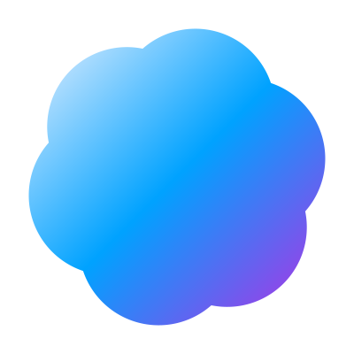
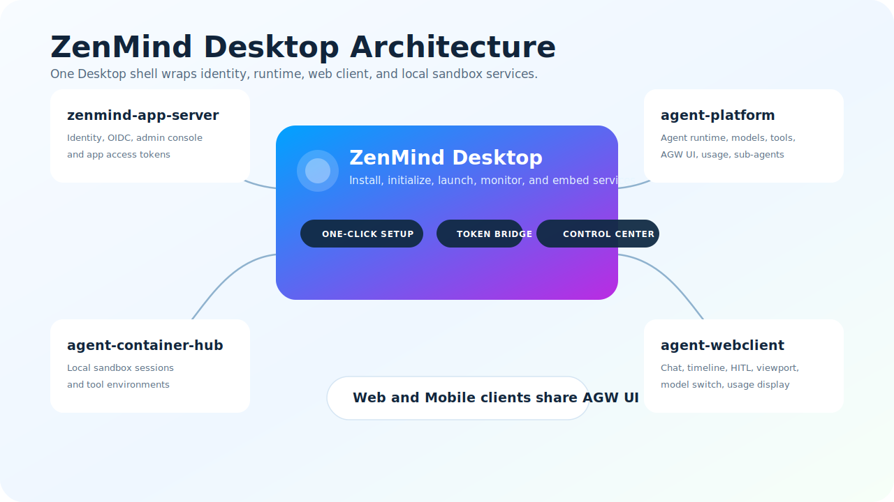

# ZenMind

[English](../README.md) | [简体中文](./README.zh-CN.md)

ZenMind 是一个以 Desktop 为入口的 AI Agent 平台，面向本地、Web 和移动端工作流。

它把核心智能体运行时封装进一个桌面应用，重点支持 DeepSeek V4、MiMo、MiniMax M3、Qwen/百炼等国产模型生态，并通过自定义 AGW UI 协议承载流式输出、人工确认、交互视图、用量统计和子智能体调用。

## 核心亮点

- 一个 Desktop 应用完成安装、初始化、启动、停止和服务监控。
- 面向 DeepSeek V4、MiMo、MiniMax M3、Qwen/百炼与 MiniMax 办公技能链路。
- 自定义 AGW UI 协议支持流式输出、HITL、viewport、usage 和子智能体。
- 本地沙箱层支持长生命周期会话、工具环境和文档办公自动化。
- 同一套智能体体验服务 Desktop、Web Client 和即将到来的移动端。

## 演示视频

> 占位：这里后续补充 ZenMind 产品演示视频。

## 截图

> 占位：这里后续补充 Desktop、智能体对话、服务中心、AGW UI 和移动端预览截图。

## Desktop 一键安装

ZenMind 通过 ZenMind Desktop 分发。Desktop 会包裹核心服务，准备本地配置，按正确顺序启动运行时，并提供统一控制中心。

> 下载占位：这里后续补充官方 Desktop 发布链接。

## 核心架构

  

ZenMind Desktop 包裹四个核心服务：

- `zenmind-app-server`：认证、OIDC、管理台和 App 访问令牌。
- `agent-platform`：智能体运行时、模型注册、工具、记忆、HITL、用量统计和子智能体编排。
- `agent-webclient`：对话前端、Timeline、模型切换、viewport 渲染和用量展示。
- `agent-container-hub`：本地沙箱会话、环境模板和容器工具运行时。

## AGW UI 协议

AGW UI 是 ZenMind 客户端与 Agent Platform 之间的自定义协议。它把 HTTP、SSE 和可选 WebSocket 传输，与丰富的智能体事件模型结合起来：

- H2A 流式输出与 attach 续接。
- `question / approval / form / plan` 四类 HITL 等待态。
- builtin viewport 与 HTML viewport 交互视图。
- token、cache、reasoning、工具调用和成本维度的 usage 快照。
- `agent_invoke` 子智能体任务，并实时汇聚回主 Timeline。

更多说明见 [AGW UI 协议](./agwui.md)。

## 文档

- [架构说明](./architecture.md)
- [AGW UI 协议](./agwui.md)
- [模型支持](./models.md)
- [移动端方向](./mobile.md)
- [文档索引](./README.md)

## License

见 [LICENSE](../LICENSE)。
