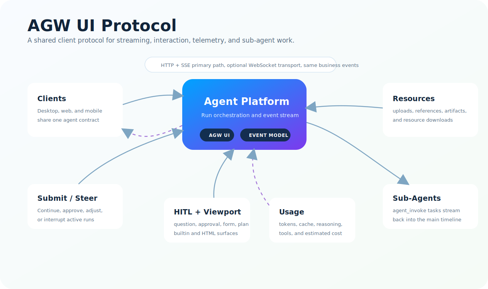

# AGW UI Protocol

AGW UI is ZenMind's interaction protocol between user-facing clients and the Agent Platform. It is designed for agent work that is streamed, interruptible, inspectable, and interactive across Desktop, web, and mobile clients.

  

## What It Does

AGW UI gives clients one shared language for agent runs:

- Start work with `query`, then observe the run through live events.
- Continue a running task with `submit`, `steer`, and `interrupt`.
- Render text, reasoning, tools, actions, tasks, artifacts, and memory events in one timeline.
- Pause execution for human input through structured awaiting states.
- Reconnect to active runs and recover missed events.

## Transport

The primary path is HTTP plus SSE:

- `POST /api/query` starts a run and streams events.
- `GET /api/attach` observes an existing run and can continue from `lastSeq`.
- Business events use a shared event envelope with `seq`, `type`, and `timestamp`.

WebSocket is an optional transport for the same semantics. It can carry request, response, stream, and push frames over one long-lived connection. It does not change the business event model.

## H2A Streaming

H2A is the streaming and render pacing layer. The platform maps provider chunks into AGW events such as `content.delta`, `reasoning.delta`, `tool.args`, and `usage.snapshot`.

Key capabilities:

- True streaming by default, with event-level flushing.
- Attach recovery for active runs by `runId`, `agentKey`, and `lastSeq`.
- Optional render buffering for smoother client display.
- Heartbeat support at the transport layer.

## HITL

HITL uses one awaiting protocol instead of separate tool-specific UI contracts.

Supported modes:

- `question`: collect missing information from the user.
- `approval`: approve, approve for the current run rule, or reject a tool action.
- `form`: render an HTML form, collect edited form data, then submit or reject.
- `plan`: confirm or reject a CODER planning result.

The client receives `awaiting.ask`, submits through `POST /api/submit`, then sees `request.submit` and `awaiting.answer` in the same run stream.

## Viewport

Viewport support lets agents ask clients to render richer UI than plain text.

- Builtin viewport is used for common question, approval, and plan confirmation.
- HTML viewport is used for form workflows and custom interactive surfaces.
- `GET /api/viewport` retrieves viewport payloads by `viewportKey`.
- View metadata belongs to `awaiting.ask` and viewport responses, not to generic tool start events.

## Usage

AGW UI treats usage as a live product surface, not just a backend log.

Usage events and summaries can include:

- prompt, completion, total, cache hit, and cache miss tokens
- reasoning tokens
- LLM call and tool call counts
- run-level and chat-level aggregates
- estimated cost metadata when model pricing is available

Clients can display `usage.snapshot` during a run and hydrate usage from chat history later.

## Sub-Agent Invocation

`agent_invoke` is the explicit sub-agent orchestration primitive.

- A main agent can invoke 1 to 5 sub-agent tasks.
- Sub-agent activity appears as `task.start`, `task.complete`, `task.cancel`, or `task.fail`.
- Reasoning, tools, and content from sub-agents stream back into the main timeline.
- The main agent receives one aggregated tool result after the sub-agent tasks finish.

This makes delegation visible to users without mixing sub-agent intermediate messages into the main agent's private conversation state.

## Resources And References

AGW UI uses shared references for files, images, screenshots, selections, and generated artifacts.

- Uploads become `Reference` objects.
- Messages can point to references with `#{{refid}}`.
- Resource downloads stay on the HTTP data plane.
- WebSocket carries control and metadata, not large file bytes.
